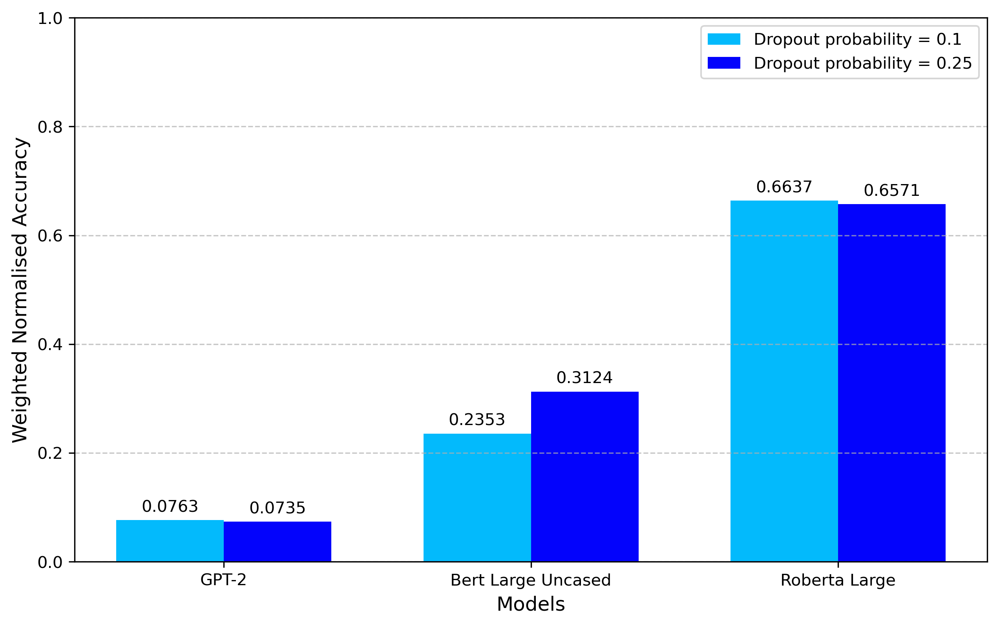
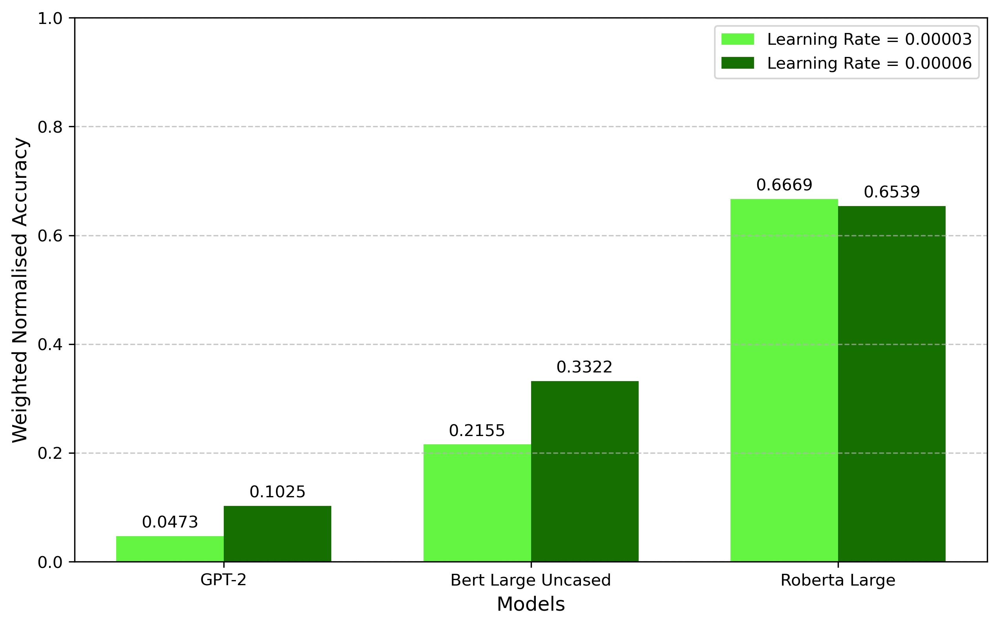
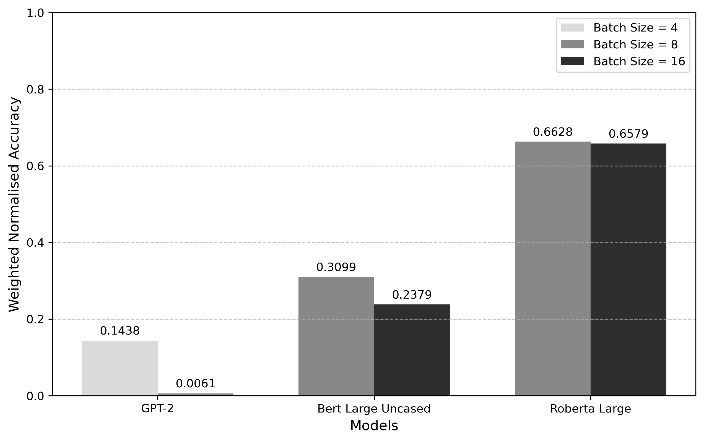
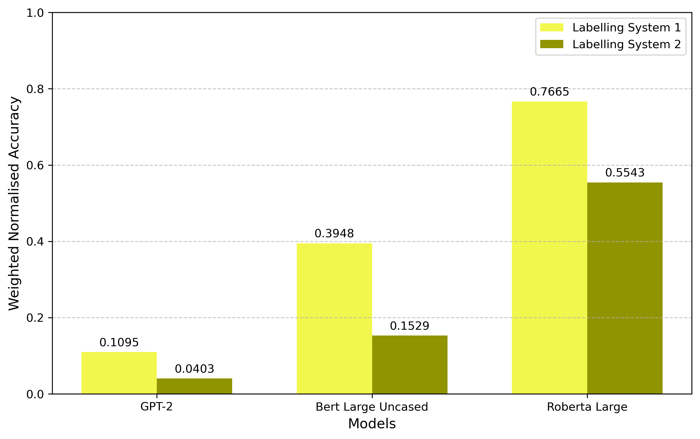
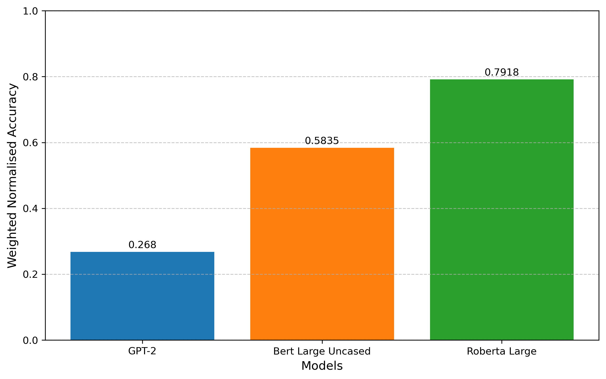

# Scripture Recognition

## Non-technical Project Overview

The aim of this project is to fine-tune a large language model to recognise when the Bible is being quoted in a Sunday sermon. For example, consider a very short sermon in which the speaker says simply: "Hello church! Today turn your Bibles to Genesis 1:1. It reads: 'In the beginning God created the heavens and the earth.' That is all for today. God bless and goodbye." The model should identify that the Bible is being quoted in the middle of the sermon.

## Data

The data for this project are labelled transcriptions of two sermons delivered at the London International Christian Church. The original sermons are available on YouTube at the following URLs:

- https://www.youtube.com/watch?v=xgQD8Lgoj4Y
- https://www.youtube.com/watch?v=R8cTEc7MKdI

The transcripts were generated by YouTube and then manually labelled by the creator of this project. The London International Christian Church has granted permission for the transcripts of their sermons to be used in this project.

### Data Format and Labelling

The data are stored in JSON format in the `data` folder of this repository. Two different labelling schemes are tried to see which one yields better results. The easiest way to understand the two labelling schemes is to look at a simple example. Consider another very short sermon, but this time with an observation from the speaker interjected in the middle of a Bible quote: "Hello church! Today turn your Bibles to John 8:32. It reads: 'Then you will know the truth, notice here it says you will know the truth, it doesn't say you will see the truth or you will find the truth, it says you will know the truth, and the truth will set you free.' That is all for today. God bless and goodbye."

The first labelling scheme labels this sermon as follows:

```
{
  "words": "hello church today turn your bibles to john 8 32 it reads then you will know the truth notice here it says you will know the truth it doesn't say you will see the truth or you will find the truth it says you will know the truth and the truth will set you free that is all for today god bless and goodbye.",
  "labels": [0, 0, 0, 0, 0, 0, 0, 0, 0, 0, 0, 0, 1, 1, 1, 1, 1, 1, 0, 0, 0, 0, 0, 0, 0, 0, 0, 0, 0, 0, 0, 0, 0, 0, 0, 0, 0, 0, 0, 0, 0, 0, 0, 1, 1, 1, 1, 1, 1, 1, 1, 1, 1, 1, 1, 0, 0, 0, 0, 0, 0, 0, 0, 0]
}
```

Notice that only the actual words of John 8:32 are are labelled as 1, while everything else, including the observation interjected in the middle of the Bible quote, is labelled 0.

The second labelling scheme labels the same sermon as follows:

```
{
  "words": "hello church today turn your bibles to john 8 32 it reads then you will know the truth notice here it says you will know the truth it doesn't say you will see the truth or you will find the truth it says you will know the truth and the truth will set you free that is all for today god bless and goodbye.",
  "labels": [0, 0, 0, 0, 0, 0, 0, 0, 0, 0, 0, 0, 1, 1, 1, 1, 1, 1, 1, 1, 1, 1, 1, 1, 1, 1, 1, 1, 1, 1, 1, 1, 1, 1, 1, 1, 1, 1, 1, 1, 1, 1, 1, 1, 1, 1, 1, 1, 1, 1, 1, 1, 1, 1, 1, 0, 0, 0, 0, 0, 0, 0, 0, 0]
}
```

Notice here that the words of John 8:32 are labelled as 1, as well as the words of the observation interjected in the middle of the Bible quote. Everything else is labelled 0, as before.

Each sermon is split into chunks, all of which are less than 512 tokens long.

## Models

Three large language models from the Hugging Face transformers library are fine-tuned for this project: GPT-2, Bert Large Uncased and Roberta Large. These models were chosen because they are state-of-the-art, open-source, and have been pre-trained on a large corpus of text data, including the Bible. All the models are fine-tuned for named entity recognition.

## Hyperparameter Optimisation

Training and testing each model consumed a significant amount of computational resources. Even running everything in Google Colab, the process took up to 10 minutes per model/hyperparameter combination. For this reason, good hyperparameters were chosen by first doing some research online to see what hyperparameters are typically used for each model for named entity recognition tasks, some manual tests were done, then a grid search was performed. Which of the labelling schemes described above was used as the training data is considered to be a hyperparameter. The number of training epochs was fixed at 15 for all models. Although it would have been interesting to include the number of training epochs as a hyperparameter, it was decided that the time and computational resources required to do so would be too great. Each of the three models was fine-tuned then tested with the following hyperparameters in every combination:

### GPT-2

- Labelling schemes: [1, 2]
- Learning rate: [3e-5, 6e-5]
- Dropout probability: [0.1, 0.25]
- Batch size: [4, 8]

### Bert Large Uncased

- Labelling schemes: [1, 2]
- Learning rate: [3e-5, 6e-5]
- Dropout probability: [0.1, 0.25]
- Batch size: [8, 16]

### Roberta Large

- Labelling schemes: [1, 2]
- Learning rate: [3e-5, 6e-5]
- Dropout probability: [0.1, 0.25]
- Batch size: [4, 8]

## Results

### Weighted Normalised Accuracy

The model/hyperparameter combinations were graded using an original metric called the "weighted normalised accuracy" score. This metric is similar to the standard accuracy metric, but with a couple of differences. Recall that the standard accuracy score is calculated as follows:

$\text{Accuracy} = \frac{TP + TN}{TP + TN + FP + FN}$

Where: $TP$ = Number of true positives, $FP$ = Number of false positives, $FN$ = Number of false negatives, $TN$ = Number of true negatives.

Unfortunately, this metric doesn't take into account the difference in importance between true positives and true negatives. In the context of this project, true positives are more important than true negatives. Suppose it is decided that true positives are $I$ times as important as true negatives. Then the "weighted accuracy" is calculated as follows:

$\text{Weighted Accuracy} = \frac{I * TP + TN}{I * AP + AN}$

Where $AP$ = Number of actual positives, $AN$ = Number of actual negatives.

Notice that this metric is guaranteed to be between 0 and 1. Moreover, notice that if $I = 1$ (i.e. true positives and true negatives are equally important), then the weighted accuracy is the same as the standard accuracy.

However, even this metric is not good for datasets with a heavy class imbalance, as is the case with the data for this project since approximately 96% of the data are labelled 0 with only 4% labelled 1. This means that a model that simply predicts 0 for every token will still have a high weighted accuracy score. For example, suppose that $I = 2$. A model can get a score of 0.92308 by predicting 0 for every token since:

$\text{Weighted Accuracy} = \frac{2 * 0 + 0.96}{2 * 0.04 + 0.96} = 0.92308$

A score of 0.92308 might look like a good score, but it's actually just about the worst possible score that any semi-intelligent model could get. For this reason, the "weighted normalised accuracy" score is better. This metric is calculated as follows:

$\text{Weighted Normalised Accuracy} = \max(\frac{I * TP + TN - K}{I * AP + AN - K}, 0)$

Where $K = \max(I * AP, AN)$

With this metric, if the model simply guesses every token to be either 0 or 1, it will get a score of 0. If the model somehow does even worse than this baseline, it will also get a score of 0. If the model does better than the baseline, it will get a score between 0 and 1. And, if the model correctly predicts every token, it will get a score of 1.

### Comparing Dropout Probabilities

Below shows a chart comparing the average weighted mean accuracy score for each model with different dropout probabilities.



As we can see, the dropout probability doesn't have a significant impact on the model's performance for the GPT-2 and Roberta models. However, for the Bert model, a dropout probability of 0.25 is better than a dropout probability of 0.1.

### Comparing Learning Rates

Below shows a chart comparing the average weighted mean accuracy score for each model with different learning rates.



As we can see, the learning rate doesn't have a significant impact on the performance of the Roberta model. However, for the GPT-2 and Bert models, a learning rate of 6e-05 is better than a learning rate of 3e-05.

### Comparing Batch Sizes

Below shows a chart comparing the average weighted mean accuracy score for each model with different batch sizes.



As we can see, the batch size doesn't have a significant impact on the performance of the Roberta model. However, for the GPT-2 model, a batch size of 4 is far better than a batch size of 8. And, for the Bert model, a batch size of 8 is better than a batch size of 16.

### Comparing Labelling Schemes

Below shows a chart comparing the average weighted mean accuracy score for each model with different labelling schemes.



As we can see, labelling scheme 1 is better than labelling scheme 2 for all models.

### Best Model/Hyperparameter Combination

The best model/hyperparameter combination was using the Roberta Large model with data labelling system 1, a learning rate of 6e-05, a dropout probability of 0.1, and a batch size of 8.



### Number of Training Examples

To see how the number of training examples affects the model's performance, the best model/hyperparameter combination was trained on 20%, 40%, 60% and 80% of the training data.


These results show that the weighted normalised accuracy score increases as the number of training examples increases. Moreover, following the apparent trend, it is likely that the weighted normalised accuracy score would continue to increase if we had more training data.

## Environment Set Up

### Google Colab

This project was developed using Google Colab. If you wish to run this project in Google Colab, simply save the data folder to your Google Drive, then open the .ipynb file you want to run in Google Colab.

### Local Environment Set Up

If you would like to run this project on your local machine, first, make sure you have Anaconda installed on your machine. If you don't, download it from the [official conda download website](https://www.anaconda.com/download). Then, run the following commands:

```
conda create -n sermon-labelling-project
conda activate sermon-labelling-project
conda install ipykernel jupyter jupyterlab
conda install pytorch torchvision torchaudio -c pytorch -c conda-forge transformers scikit-learn numpy
```

You will need to go through the .ipynb files and edit any code written to run in Google Colab.