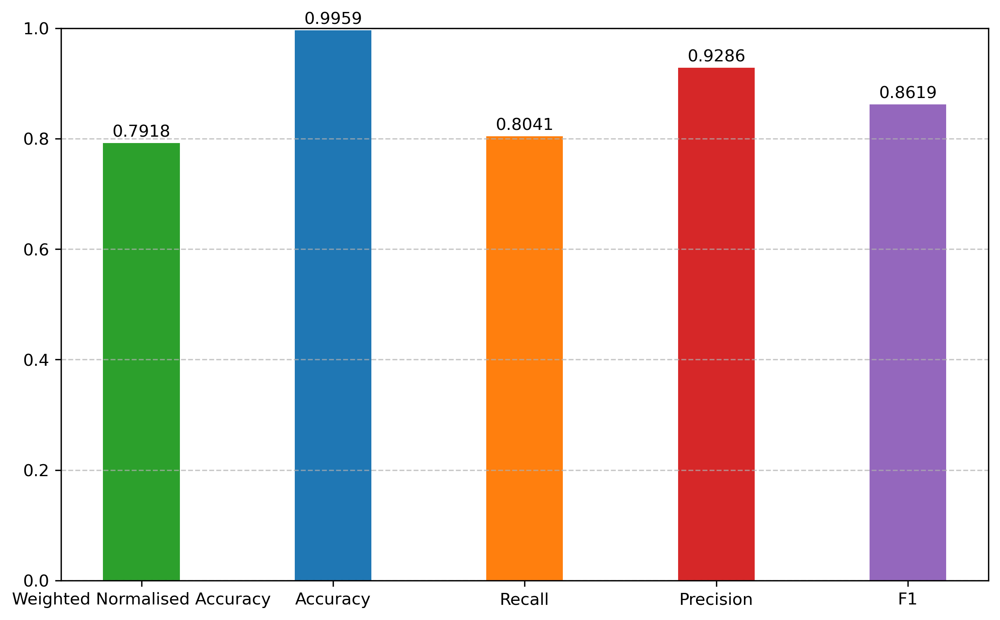
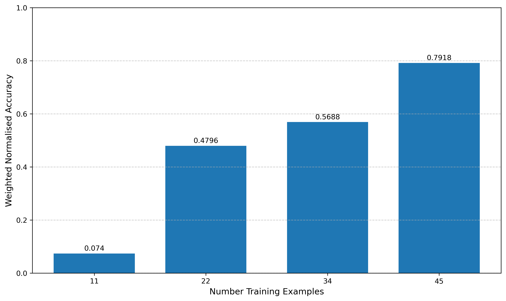

# Model Card

## Model Description

**Input:** The input to the model is a string of text which is a snippet from a sermon. The snippet must be no longer than 512 tokens long.

**Output:** An array of 0s and 1s where a 0 value indicates that the model predicts that the corresponding token in the input text is not a Bible quote and a 1 value indicates that the model predicts that the corresponding token in the input text is a Bible quote.

**Model Architecture:** The model is a fine-tuned version of the Roberta-large model used for named entity recognition. The architecture of the model can be found [here](https://huggingface.co/FacebookAI/roberta-large). In summary, Roberta Large is a transformer model with 24 layers, 1024 hidden units, 16 attention heads, and 355 million parameters.

## Performance

The best hyperparameter combination produced the following score:

## Limitations

The model produces both false positive and false negatives. This is likely due to a lack of training data since, as we can see in the following chart:

The model's performance is increasing reliably with the number of training examples. Therefore, the primary limitation is a lack of data.

## Trade-offs

As outlined in the README of this repository, the first data labelling system was used since it yielded better results than the second data labelling system. Using this labelling system is itself a trade-off since it is not a precise as the second labelling system.